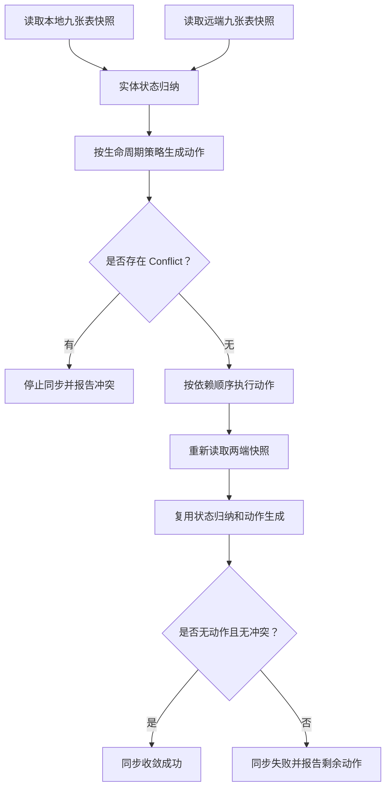

# r037 同步实体生命周期设计文档

日期：2026-06-27

需求澄清文档：`docs/request-clarify/r037-sync-entity-lifecycle.md`

## 核心功能（WHAT）

补全 Supabase 真实双向同步的实体生命周期模型。同步系统需要同时理解业务表当前投影和 `sync_changes` 历史事实，按九张同步表的生命周期策略归纳实体状态，生成 upsert、delete、sync-change 和 conflict 动作，再按依赖顺序执行并验证收敛。修复目标不是让 field 删除单点通过，而是让所有同步实体都脱离“缺行默认补行”的隐含模型。

### 需求背景（WHY）

当前同步流程读取本地和远端九张表快照后，按主键或复合键比较 row。单边缺失会直接生成写入另一侧的 upsert；双方都有 row 但字段不同才通过 `sync_changes.created_at` 判断较新方向。这个模型对 notes 软删除可以工作，因为 note row 仍存在；对 `note_tags`、`note_links` 这类关系也只有部分删除能力；对 `fields` 这种主表物理删除没有表达能力。删除两个空 field 后，本地只剩 `field/delete` sync change，远端仍有旧 field row，现有 diff 无法把本地缺行解释成 tombstone，最终触发同步冲突。

### 需求目标（GOAL）

| 目标 | 说明 |
| --- | --- |
| 生命周期完整建模 | 九张同步表都必须明确生命周期策略，禁止只覆盖少数实体 |
| 状态驱动 diff | 每个业务实体先归纳为生命周期状态，再通过状态矩阵生成动作 |
| 动作模型扩展 | diff 输出支持 upsert、delete、sync-change 和 conflict，不再只有写本地和写远端两类 upsert |
| tombstone 语义 | 物理删除实体通过缺行加最新 delete change 表达删除事实 |
| 事实集合补齐 | `sync_changes` 按 change id 补齐事实集合，不参与自己的 freshness 判断 |
| 依赖顺序执行 | 删除、解除关系、upsert 和事实补齐按实体依赖顺序执行 |
| 收敛验证统一 | 写入后重新读取两端快照，用同一状态模型验证没有剩余动作或冲突 |

### 范围边界

纳入范围：同步 diff 模型、实体生命周期策略、实体状态归纳、动作集合、动作执行顺序、本地 SQLite 写入能力、Supabase REST 写入和删除能力、`/sync/run`、`/sync/push`、`/sync/pull` 三个入口共享的同步语义、相关自动化测试和真实 Supabase 回归验证。

不纳入范围：不新增数据库 schema，不修改 migration，不在本仓库发明 DDL、字段、索引、约束、触发器或函数；不实现人工冲突 UI；不引入 Supabase Realtime、trigger 或数据库函数作为同步核心；不把本需求降级成 field 删除的局部修复；不保留未定义实体继续按缺行默认补行的行为。

## 实现流程（HOW）

### 总体架构

同步流程保留“读取两端快照、计算差异、执行写入、重新验证”的宏观结构，但中间层从 row diff 升级为 lifecycle diff。读取层仍负责拿到九张表完整快照；状态归纳层把每个实体转换成生命周期状态；动作生成层根据状态矩阵输出动作；执行层按动作类型和依赖关系写入本地或远端；收敛层重新读取快照并复用同一套归纳和动作生成逻辑检查结果。

### 生命周期策略

每张同步表必须有明确策略，策略用于决定 row 存在性、删除事实、状态归纳和动作执行方式。

| 表 | 生命周期类型 | 删除事实来源 | 同步处理 |
| --- | --- | --- | --- |
| `workspaces` | 软删除实体 | row 内 `deleted_at` 或 `archived_at` | 通过 upsert 同步 row 状态，不物理删除 |
| `devices` | 保留实体 | 当前不支持物理删除事实 | 缺失时补齐，若出现未定义 delete 事实则冲突 |
| `fields` | 物理删除实体 | `sync_changes` 中 `field/delete` | tombstone 胜过旧 row，按依赖顺序删除仍存在的一侧 |
| `tags` | 保留实体 | 当前不支持物理删除事实 | 缺失时补齐，若出现未定义 delete 事实则冲突 |
| `notes` | 软删除实体 | row 内 `deleted_at`，归档由 `archived_at` 表达 | 通过 upsert 同步 row 状态，不物理删除 |
| `note_revisions` | 只追加投影实体 | 当前不支持删除事实 | 缺失时补齐，字段差异按 revision 规则或冲突处理 |
| `note_tags` | 关系实体 | `sync_changes` 中 `note_tag/detach` 或等价删除事实 | detach tombstone 胜过旧关系 row，删除仍存在的一侧关系 |
| `note_links` | 关系实体 | `sync_changes` 中 `note_link/detach` 或等价删除事实 | detach tombstone 胜过旧关系 row，删除仍存在的一侧关系 |
| `sync_changes` | 只追加事实 | 不适用 | 按 change id 补齐事实集合，不作为普通业务实体判断自己的新旧 |

`devices` 和 `tags` 当前按保留实体处理，是为了把未定义删除语义显式化。若未来要支持 device 或 tag 删除，必须先把它们的生命周期策略从保留实体改为软删除实体、物理删除实体或关系实体，并补齐依赖规则；禁止让未定义 delete 事实静默落入普通补行逻辑。

### 实体状态

每个业务实体在本地和远端各自归纳成状态。状态归纳输入包括业务 row 是否存在、row 内删除态、该实体最新相关 `sync_changes`、最新 operation、最新 `created_at` 和 change id。

| 状态 | 含义 |
| --- | --- |
| `Present` | 业务 row 存在，最新事实不表示物理删除或关系解除 |
| `SoftDeleted` | 业务 row 存在，row 内删除态或归档态生效 |
| `Tombstoned` | 业务 row 不存在，最新事实是 delete 或 detach |
| `AbsentUnknown` | 业务 row 不存在，也没有可证明删除的事实 |
| `Inconsistent` | 业务 row 与最新事实矛盾，例如 row 存在但最新事实是物理 delete |

软删除实体的 `SoftDeleted` 仍然属于有 row 的当前投影；物理删除实体的 `Tombstoned` 没有业务 row，只能靠 `sync_changes` 保留事实。关系实体的 `Tombstoned` 表示关系解除，不代表关系两端主实体删除。

### 状态矩阵

状态矩阵生成同步动作。该矩阵适用于所有业务实体，具体动作如何执行由生命周期策略决定。

| 本地状态 | 远端状态 | 动作 |
| --- | --- | --- |
| `Present` 或 `SoftDeleted` | `AbsentUnknown` | `UpsertRemote` |
| `AbsentUnknown` | `Present` 或 `SoftDeleted` | `UpsertLocal` |
| `Tombstoned` | `Present` 或 `SoftDeleted` | `DeleteRemote` 和必要的 `SyncChangeRemote` |
| `Present` 或 `SoftDeleted` | `Tombstoned` | `DeleteLocal` 和必要的 `SyncChangeLocal` |
| `Tombstoned` | `AbsentUnknown` | 向缺少 tombstone 的一侧补齐 `sync_changes` |
| `AbsentUnknown` | `Tombstoned` | 向缺少 tombstone 的一侧补齐 `sync_changes` |
| `Tombstoned` | `Tombstoned` | 只补齐缺失的 `sync_changes` |
| `Present` 或 `SoftDeleted` | `Present` 或 `SoftDeleted` 且 row 相同 | 只补齐缺失的 `sync_changes` |
| `Present` 或 `SoftDeleted` | `Present` 或 `SoftDeleted` 且 row 不同 | 按最新业务事实顺序生成 upsert；无法判断则 `Conflict` |
| `Inconsistent` | 任意 | `Conflict` |
| 任意 | `Inconsistent` | `Conflict` |

如果两端最新事实时间相同但 change id、operation 和实体状态一致，则不应产生冲突；如果时间相同且状态或 row 无法推出唯一当前结果，则产生 `Conflict`。equal timestamp 不再被无条件视为冲突。

### 动作模型

diff 输出统一动作集合，不再输出两个只支持 upsert 的列表。

| 动作 | 含义 |
| --- | --- |
| `UpsertLocal` | 用远端当前投影修正本地业务 row |
| `UpsertRemote` | 用本地当前投影修正远端业务 row |
| `DeleteLocal` | 根据远端 tombstone 或 detach 删除本地业务投影 |
| `DeleteRemote` | 根据本地 tombstone 或 detach 删除远端业务投影 |
| `SyncChangeLocal` | 本地缺少某条 sync change，写入本地 |
| `SyncChangeRemote` | 远端缺少某条 sync change，写入远端 |
| `Conflict` | 两端事实不足以判断唯一当前状态 |

动作必须携带表、实体键、目标侧和动作原因。动作原因用于日志、测试断言和冲突记录，但不能把详细数据默认输出到后台同步日志；后台日志仍应保持现有 count-only 风格。

### 执行顺序

执行器按动作类型和实体依赖顺序写入，不能只按固定表 upsert 顺序处理。推荐顺序是：先补齐会被下游引用的主表 upsert；再应用软删除状态；再执行关系删除；再解除物理删除主表前的依赖；再执行主表物理删除；再执行剩余主表 upsert；再执行关系 upsert；最后补齐 `sync_changes`。`sync_changes` 放在最后可以避免业务投影写入失败后留下已经传播但未应用的事实。

field 物理删除的执行策略必须先处理 notes 引用。对于本地删除，沿用业务接口口径，删除前只清理已删除或已归档 notes 的 `field_id`，可见 note 仍引用 field 时进入冲突而不是强行改写可见 note。对于远端删除，也必须执行同等依赖处理或在发现远端可见 note 仍引用 field 时进入冲突，禁止因外键失败后再把问题伪装成普通同步失败。

关系实体删除不删除主实体。`note_tags` detach 只删除对应关系 row；`note_links` detach 只删除对应 link row。软删除实体不做物理 DELETE，只通过 upsert row 内删除态收敛。

### 入口语义

`/sync/run`、`/sync/push` 和 `/sync/pull` 继续保留，但三者必须共享同一套状态归纳和动作生成。`/sync/run` 执行两侧动作直到本轮收敛；`/sync/push` 只执行目标为远端的动作和远端缺失的必要事实补齐；`/sync/pull` 只执行目标为本地的动作和本地缺失的必要事实补齐。三个入口都必须在写入后使用同一收敛验证逻辑，不能各自维护独立 diff 分支。

### 冲突处理

冲突表示同步系统无法从当前事实推出唯一结果。典型冲突包括：row 与最新 tombstone 矛盾、保留实体出现 delete 事实、物理删除实体仍被可见依赖引用、两端 row 不同但最新事实顺序无法区分、同 timestamp 但 operation 或状态不一致。冲突应阻断相关同步并返回错误；后台同步日志只输出冲突数量，详细冲突可通过测试、临时诊断或后续冲突记录能力查看。

### 收敛验证

每次执行后必须重新读取本地和远端完整快照，并重新运行生命周期状态归纳和动作生成。只有动作集合为空且冲突为空，才算同步成功。验证不能只看 HTTP 成功、SQL 成功或 `sync_changes` 已补齐；必须确认业务投影和同步事实共同收敛。

## 测试用例

### 编译检查

| 用例 | 预期 |
| --- | --- |
| `cargo fmt --check` | 格式检查通过 |
| `cargo check` | 编译通过 |
| `cargo clippy -- -D warnings` | 无 clippy warning |

### 自动化测试

| 用例 | 预期 |
| --- | --- |
| 九张表生命周期策略覆盖 | 每张同步表都有明确策略，缺策略无法通过测试 |
| `sync_changes` 事实补齐 | change id 单边缺失时只生成 `SyncChangeLocal` 或 `SyncChangeRemote` |
| field tombstone 对远端 present | 生成 `DeleteRemote` 和必要事实补齐，不生成 `UpsertLocal` 或冲突 |
| field tombstone 对本地 present | 生成 `DeleteLocal` 和必要事实补齐，不生成 `UpsertRemote` 或冲突 |
| notes 软删除 | row 存在且 `deleted_at` 较新时生成 upsert 动作，不生成物理删除动作 |
| note_tags detach | detach tombstone 对 present relation 生成关系删除动作 |
| note_links detach | detach tombstone 对 present relation 生成关系删除动作 |
| 保留实体 delete 事实 | `devices` 或 `tags` 出现未定义 delete 事实时生成冲突 |
| equal timestamp 同事实 | 两端最新 change id、operation、状态一致时不冲突 |
| equal timestamp 不同事实 | 两端状态或 operation 不一致时生成冲突 |
| 物理删除依赖保护 | field 被可见 note 引用时删除动作生成冲突或执行失败并回滚 |
| 本地动作执行事务 | 本地一组动作失败时不部分提交 |
| 远端 DELETE 请求 | Supabase DELETE 请求按表和键过滤正确 |
| `/sync/run` 回归 | 使用生命周期模型执行双向动作并验证收敛 |
| `/sync/push` 回归 | 只执行远端目标动作和远端事实补齐 |
| `/sync/pull` 回归 | 只执行本地目标动作和本地事实补齐 |

### 手工检查

| 用例 | 预期 |
| --- | --- |
| 真实 Supabase field 删除同步 | 本地删除空 field 后，远端 field row 被删除，两端保留一致 delete tombstone |
| 真实 Supabase 二次后台周期 | 删除同步后一轮后台周期无新增冲突，返回 pushed=0、pulled=0 或等价无动作结果 |
| 真实 Supabase notes 软删除回归 | note 删除仍表现为 row 内 `deleted_at` 同步，不发生物理删除 |
| 真实 Supabase 关系解除回归 | note tag detach 和 note link detach 在两端关系表收敛 |

### 回归检查

| 用例 | 预期 |
| --- | --- |
| 搜索缺行默认补行逻辑 | 不存在未经过生命周期策略的普通缺行补齐分支 |
| 搜索 `sync_change` freshness 自引用 | `sync_changes` 不再通过 `entity_type = "sync_change"` 判断自己的新旧 |
| 搜索 field-only 特殊分支 | 不存在只为 field 绕开统一状态机的同步分支 |
| 真实同步最终快照比较 | 业务投影和 `sync_changes` 事实集合共同收敛，无剩余动作和冲突 |
